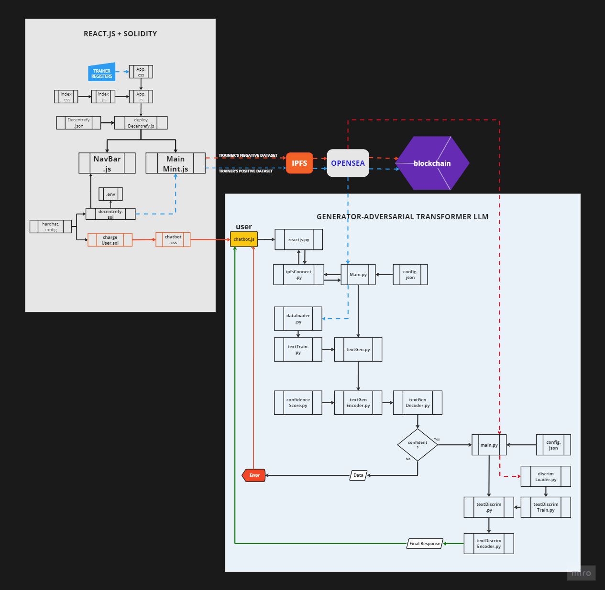

#**Generator-Adversarial Transformer Large Language Model (GATLLM) with ERC721 as incentivization mechanism**

Here's a breakdown of the key elements to consider:

###**TYPES OF USERS***
THERE WILL BE MAINLY TWO (2) TYPES OF USERS :
**(1)   TRAINERS**
        Trainers are people who wants to help train this **GATLLM** to achieve its **goal**, they will use our
        site 'Decentrefy.com', which can connect to Metamask via Web3.js where they mint an ERC721 NFT that
        contains basic information about themselves and the datasets they are contributing, their NFT will be
        launched into Opensea and stored into *IPFS* or *UNLOCKABLE* feature of Opensea. So that any 3rd party
        who wants to buy their dataset, can buy their NFT, this is a form of incentivization for trainers to
        keep contributing data as per Decentrefy's **goal**. However, please note that the 'trainers' need to
        pay for the gas fee on ethereum whenever they mint their ERC721.

**(2)   PUBLIC USERS WHO PROMPTS**
        These are common people a.k.a *'public'* who uses the chatbot feature available in 'Decentrefy.com'.
        They need to pay (for now) 0.003 ETH per month, the price will change as deemed necessary.

###**Datasets**
There will be two types of datasets that interested *'trainers'* to choose:
(i)  POSITIVE DATASETS - WHICH ARE DATA THAT CAN TRAIN THE GENERATOR MODEL TO GENERATE RESPONSE
(ii) NEGATIVE DATASETS - THESE ARE *'INSTRUCTIONAL'* DATASETS TO TRAINS DISCRIMINATOR MODEL WITH GRADUAL ERROR DESCENT

###**ERC721:**
We use ERC721 to store trainers' datasets into Opensea where they can choose the option to store it as an 'Unlockable' where they can get paid for their datasets. The reason to use ERC721 is also to allow us to trace who contributed the dataset, that helps make this model 'explainable'.

###**TRAINING *GOAL***
Our main goal for this model is to train it to be able to generate highly accurate response as the interaction between users, the generator and discriminator models will form a continuously improving as it progresses. For the purpose of 
this new model, we will begin by training this GATLLM on:

**"CODING IN PYTHON PROGRAMMING LANGUAGE FIRST, BEFORE WE MOVE ONTO OTHER PROGRAMMING LANGUAGES LIKE C++, BEND, ETC"**
Rationale for this is because we **NEED TO HAVE AN LLM THAT CAN CREATE BETTER AL MODELS**, because large proportion of
AI / LLMs are coded in Python followed by C++, Pybinding, etc so it make sense to create a true 'expert' in Python, so
that this allows more coders to jointly innovate better models continuously. 

###**TRAINING STRATEGY**
We will first and foremost feed in as many information about the fundamentals of programming, they types of styles of coding, what is python, how to code in Python, etc. Followed by feeding it with as many python codes as possible.

###**PREPROCESSING**
Prior to feeding as many python codes from repositories into this model, we will need to use appropriate tools like *'static code analysis'* or *'Linters and formatters'* or *'Code runners with error reporting'* like *replit.com*, *jdoole.com*, etc.

From this exercise we would be able to segregate out good codes from the bad ones, that allows us to plan the training
of discriminator model with a carefully injected small errors like missing a ')' or '_', etc with gradually greater number of errors and then feeding in the corrected codes as the 'pair' in this instructional dataset. The strategy is to gradually build the model to 'understand' the basics of programming, what is a good code, what is a bad coding and what variable or functions to use, which algorithm is better to suite certain situations, etc.

###**Confidence Score:** 
The generator model also have a *'confidence scoring metric'* that we designed from cosine similarity metric that will
compare the input from users with the generator model's current training dataset (weights & biases) to determine if it
is confident enough to generate an accurate answer. IF it is not, it will return an error message to inform that it is
not able to accurately inference their prompt, so users need to be warned of this and if they continue, its  their own 
decision. This warning also allows us to further train the model with more data.

IF the confidence score is high, then the generator model will pass its output to the discriminator model to verify and
counter check for possible errors, this discriminator model will make the necessary correction before outputing it back
to the chatbot interface, if the user finds it not to their expectations, it will re-prompt and  the interaction  will
allow both the generator and discriminator model to progressively get the best and most accurate codes out. 

####**Adaptive Threshold**:
The minimum confidence score required for a response to be accepted could dynamically adjust based on network reliability or task difficulty.

Blockchain-inspired Approaches: By employing ERC721, Opensea, IPFS and Ethereum, we are making use a robust consensus protocol like Proof-of-Stake (PoS) to make this model more transparent and *'explainable'*.

#**MORE DETAILS**

###**Generator vs. Discriminator Roles:**

Generators:
Focus on generating accurate and relevant responses to prompts.
Trained on high-quality datasets to minimize factual errors or biases.

Discriminators:
Analyze responses from generators and identify potentially false or misleading information.
Utilize fact-checking techniques and knowledge bases to evaluate responses.

Communication Protocol:
Define a clear communication protocol for generators and discriminators to exchange information during the consensus process (e.g., proposed responses, confidence scores, discrimination feedback).

####**Attention Mechanism**
Both the generator and discriminator models are using two combined attention mechanisms to allow a wholer and
yet detailed and specific focus on the input, y using Full Stack Transformer Encoder-Decoder with Sliding Window and Global Attention.

a. Pre-processing:

Text Tokenization: Convert text into sequences of tokens (words or sub-words) using a tokenizer like SentencePiece or Byte Pair Encoding (BPE).
Padding: Pad sequences to a fixed length for batch processing.
Positional Encoding: Add positional encoding information to account for word order within the sequence, as transformers lack inherent understanding of order.

b. Model Architecture:

Embedding Layer: Convert tokens into dense vectors using an embedding layer.

Encoder Stacks:
Each encoder stack consists of multiple transformer encoder blocks.
A transformer encoder block includes:
Multi-head Self-Attention: This allows the model to attend to relevant parts of the input sequence for each head, capturing relationships between words.
Position-wise Feed Forward Network: This injects non-linearity into the model's learning process.
Layer Normalization: Improves gradient flow during training.

Decoder Stacks:
Each decoder stack consists of multiple transformer decoder blocks.

A transformer decoder block includes:
Masked Multi-head Self-Attention: Similar to encoder self-attention, but masks future tokens to prevent information leakage during generation.

Multi-head Attention over Encoder Outputs: Attends to relevant parts of the encoded input sequence, allowing the decoder to generate text based on the context.

Position-wise Feed Forward Network: Similar to the encoder.
Layer Normalization: Similar to the encoder.

Output Layer: Convert the decoder output back into tokens using a softmax layer.

c. Training:

Define an appropriate loss function like teacher forcing or masked cross-entropy to measure the difference between generated text and the target text. We use an optimizer like Adam to update model weights based on the loss function during backpropagation.

2. Encoder-only Transformer with Classification Head (Discriminator):

a. Pre-processing:

Text Tokenization: Similar to the generator.
Padding: Similar to the generator.

b. Model Architecture:

Embedding Layer: Similar to the generator.
Encoder Stacks: Similar to the generator's encoder stacks.

Classification Head:
A feed-forward neural network with one or more hidden layers.
Final output layer with a sigmoid activation function to predict the probability of the input text being real (0) or fake (1).

c. Training:
Prepare a dataset with real and fake text samples.
Define a binary cross-entropy loss function to measure the difference between the predicted probability and the actual label (real or fake).

Use an optimizer like Adam to update model weights based on the loss function during backpropagation.
Additional Considerations:

Implement dropout layers for regularization to prevent overfitting.
Utilize techniques like gradient clipping to address exploding gradients during training.
Consider hyperparameter tuning to optimize model performance.
